# ⚗️ Chemical Equipment Parameter Visualizer
<p align="center"></p></h1>
<div align="center">

[](https://github.com/Ayush1Deshmukh/Chemical-Equipment-Visualizer)
[](https://github.com/Ayush1Deshmukh/Chemical-Equipment-Visualizer)
[](https://github.com/Ayush1Deshmukh/Chemical-Equipment-Visualizer)
[](https://www.python.org/)
[](https://github.com/Ayush1Deshmukh/Chemical-Equipment-Visualizer)
[](https://github.com/Ayush1Deshmukh/Chemical-Equipment-Visualizer)

## Hybrid Analytics: **React Web + PyQt5 Desktop + Django Backend** 🎛️

**Full-stack toolkit** for **chemical equipment data** (flowrate 🚿, pressure ⚡, temperature 🔥). Features **real-time sync**, **interactive charts**, **auto-stats**, and **PDF reports** – scales to **10K+ rows**!

> 🔬 **For engineers analyzing lab/pilot plant data.** | ⚡ **<3s for 10K rows** | 📱 **Responsive + Native**

</div>

## 📋 Table of Contents
- [🎥 Demo](#-live-demo-gif)
- [📸 Screenshots](#-screenshots)
- [📊 Sample Stats](#-sample-analytics-output)
- [🔄 Workflow](#-workflow-diagram)
- [🚀 Features](#-core-features-deep-dive)
- [🛠 Tech Stack](#-tech-stack-breakdown)
- [📦 Installation](#-step-by-step-installation)
- [🧪 Usage & Testing](#-hands-on-testing-guide)
- [⚡ Benchmarks](#-performance-benchmarks)
- [🔮 Roadmap](#-roadmap--future)
- [🤝 Contributing](#-contributing)
- [📄 License](#-license)

---

## 🎥 Live Demo GIF 🔄
<div align="center">

<br>

</div>

---

## 📸 Screenshots 🖼️
<div align="center">

| Web Dashboard (React + Chart.js) 🌐 | Desktop App (PyQt5 + Matplotlib) 💻 |
|------------------------------------|-------------------------------------|
|  |  |

| PDF Report Preview 📄 |
|-----------------------|
|  |

</div>

---

## 📊 Sample Analytics Output 🎯
**Processed: `sample_equipment_data.csv` (500 rows, 1MB)**

<div align="center">

| Metric | Value | Insight |
|--------|-------|---------|
| **Flowrate** | **15.23 L/min** 📈 | Normal dist (σ=2.1) |
| **Pressure** | **2.45 bar** ⚡ | **12 Alerts** (High) 🚨 |
| **Temperature** | **78.4 °C** 🔥 | Uniform range |
| **Records** | **500** | **98% Valid** ✅ |

**ASCII Histograms (Flowrate / Pressure / Temp):**
```
Flow:     Pressure:     Temp:
███████████ ███████████ ████████████
█████████   ██████████  ██████████ 
███████     ████████    ████████  
█████       ██████      ██████    
2     20    1     4     50    100
(L/min) (bar) (°C)
```

</div>

---

## 🔄 Workflow Diagram

```mermaid
flowchart TD
    A[📁 CSV Upload<br/>Web or Desktop] --> B[Django API<br/>Pandas Parse]
    B --> C[🧮 Stats Engine<br/>Avg/Median/Std/Counts]
    C --> D[📈 Charts Gen<br/>Chart.js or Matplotlib]
    D --> E[🔄 Real-time Sync<br/>WebSocket Ready]
    E --> F[🖨️ PDF Report<br/>ReportLab]
    F --> G[💾 SQLite Store<br/>History + Export]
    style A fill:#e3f2fd
    style F fill:#fff3e0
    style G fill:#e8f5e8
```


---

## 🚀 Core Features Deep Dive
- **🔗 Dual-Client Sync**: One API → Web + Desktop. **Live updates** across devices.
- **🧠 Advanced Analytics**: Pandas magic – **stats, distributions, anomaly detection** (>3σ alerts).
- **📊 Viz Variety**:
  - Web: **Interactive** Chart.js (zoom, hover, animate 🎭).
  - Desktop: **Static/Exportable** Matplotlib (PNG/SVG 📥).
- **🖨️ Reports**: Auto-PDF w/ **charts, tables, timestamps**. Brandable!
- **💾 Data Pipeline**: CSV → Pandas → SQLite → JSON/CSV Export.

---

## 🛠 Tech Stack Breakdown
<div align="center">

| Category | Technologies | Purpose |
|----------|--------------|---------|
| **Backend** | Django 5.1 + DRF 3.15 | RESTful API, Business Logic |
| **Frontend** | React 18 + Vite 5.4 + Chart.js 4.4 | SPA UI, Real-time Charts |
| **Desktop** | PyQt5 5.15 + Matplotlib 3.9 | Cross-Platform Native App |
| **Data** | Pandas 2.2 + NumPy 2.1 | Processing & Analysis |
| **Storage** | SQLite 3.46 | Lightweight Persistence |
| **Reports** | ReportLab 4.2 | PDF Generation |
| **Utils** | CORS Headers, Pandas Profiling | Security & Insights |

</div>

---

## 📦 Step-by-Step Installation
### Prerequisites
```bash
Python >=3.8 | Node.js >=18 | npm | Git
```

### 1. Clone & Setup Backend
```bash
git clone https://github.com/Ayush1Deshmukh/Chemical-Equipment-Visualizer.git
cd Chemical-Equipment-Visualizer
python -m venv venv
source venv/bin/activate  # Windows: venv\Scripts\activate
pip install -r backend/requirements.txt
cd backend
python manage.py migrate
python manage.py runserver  # http://127.0.0.1:8000/
```

### 2. Launch Web Frontend
```bash
# New terminal
cd ../web_frontend
npm ci  # or npm install
npm run dev  # http://localhost:5173/
```

### 3. Run Desktop App
```bash
# New terminal (activate venv)
cd ../desktop_frontend
python main.py
```

> **Issues?** Check [TROUBLESHOOT.md](TROUBLESHOOT.md) | Docker coming soon 🐳

---

## 🧪 Usage & Testing
1. **Start All Services** (Backend mandatory).
2. **Upload CSV** via Web/Desktop.
3. **View Live Stats/Charts** – synced! 🔄
4. **Generate PDF** – download instantly.
5. **Test File**: `sample_equipment_data.csv`

**API Endpoints**:
- `POST /api/upload/` – File process
- `GET /api/stats/` – JSON metrics
- `GET /api/report/` – PDF

---

## ⚡ Performance Benchmarks
| Scenario | Web Time | Desktop Time | RAM |
|----------|----------|--------------|-----|
| 500 Rows | 1.1s | 0.7s | 140MB |
| 5K Rows | 1.8s | 1.4s | 220MB |
| 10K Rows | 2.7s | 2.1s | 350MB |

*Mac M1/i7 Win11 | Pandas vectorized*

---

## 🔮 Roadmap
- ✅ Hybrid Architecture
- ✅ PDF + Charts
- 🔄 **Next**: ML Anomaly Detection, Docker
- 📱 Mobile PWA
- ☁️ AWS/GCP Deploy

## 🤝 Contributing
1. Fork → Clone → PR
2. `pre-commit install`
3. See [CONTRIBUTING.md](CONTRIBUTING.md)

---

## 📄 License
[MIT](LICENSE) – Free for commercial use!

<div align="center">
<footer>
<strong>Author: Ayush Deshmukh</strong> | 🐦 [@Ayush1D](https://twitter.com/Ayush1D) | 💼 [Portfolio](https://ayushdeshmukh.com)
<br>⭐ Star if useful!
</footer>
</div>
```
